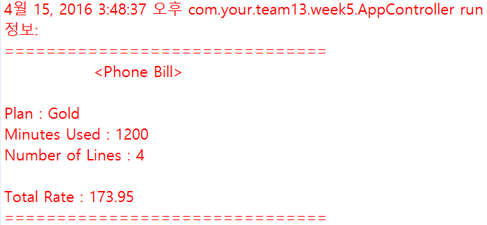
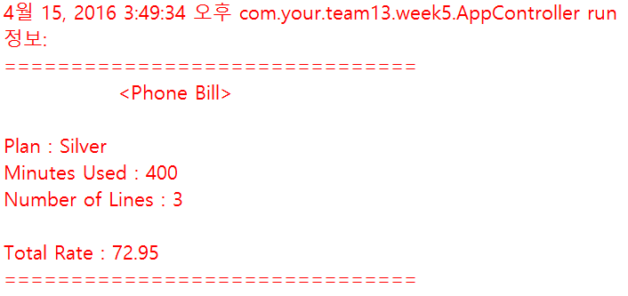

# team13_week5

##전화 요금 고지서 프로그램

이 프로그램은 전화요금을 조회하는 프로그램입니다. 

이 프로그램을 실행하면 Plan, 총사용시간 , 사용회선을 기반으로 총 금액이 출력됩니다.

##Development environment
JDK: 1.8
SonarQube: 5.4
Eclipse IDE, Maven Project
Jenkins: 1.654

##Team
 - **201302449 Sangjun Lee**
 - **201402351 Eunsik Park**
 - **201402334 Jihyun Kim**
 - **201402403 Jungeun Lee**
 
##실행 방법

### 1. Git clone 
 이클립스의 git repository창에서 git clone을 한 다음 project explorer에 import한다.

### 2. Junit Test 
 test파일을 실행할 때 junit test로 실행한다.
 
### 3. Output

